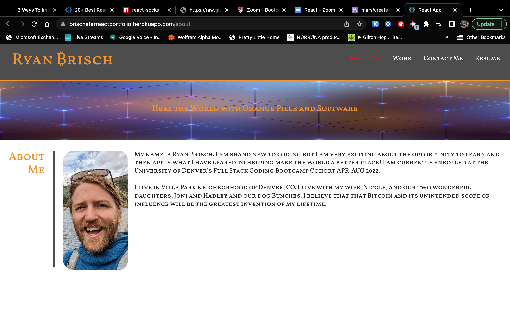

# Brischster-X-React

This is your portfolio, this is your portfolio on REACT!!

# <ins>Brischster-X-React</ins>

## <ins>Table of Contents</ins>

1. [Description](#description)
2. [Installation Instructions](#how_to_install)
3. [How to Use](#how_to_use)
4. [How to Contribute](#how_to_contribute)
5. [Tests](#test_cases)
6. [Badges and License](#badges_and_license)
7. [Credits/Collaborators](#credits_and_collaborators)
8. [Contact Information](#author_Contact_information)

### <ins>Description</ins>

That is was my portfolio with just HTML & CSS, this is my portfolio on REACT!!

Took my not so great porfolio and refactored it into single page React app. I was able to use React Routes website and teach myself how to use routes, so the nav bar and main image appear static, but clicking through the different routes provides a very quick and smooth experience for the user.

### <ins>How to Install</ins>

1. Clone Github repository and install necessary frameworks

[Live Link to Portfolio](https://brischsterreactportfolio.herokuapp.com/resume)

### <ins>How to Use/Screenshot </ins>

### <ins>How to Contribute </ins>

[Code of Conduct Expected by All Contributors](https://www.contributor-covenant.org/version/2/1/code_of_conduct/)

[Report bugs or make feature requests](https://github.com/brischster/Brischster-X-React/issues)

Follow the above link to formally report bugs or make feature requests through the Github repository.

Also please feel free to email me at the email provided below.

### <ins>Tests Cases </ins>

Tried and true!

### <ins>Badges and License</ins>

MIT

### <ins>Credits and Collaborators</ins>

Ryan Brisch 
React 
React Routes 

### <ins>Author's Contact Information</ins>

Ryan Brisch 
[Github Profile](https://github.com/brischster) 
[Email Ryan](mailto:brischster@gmail.com)
